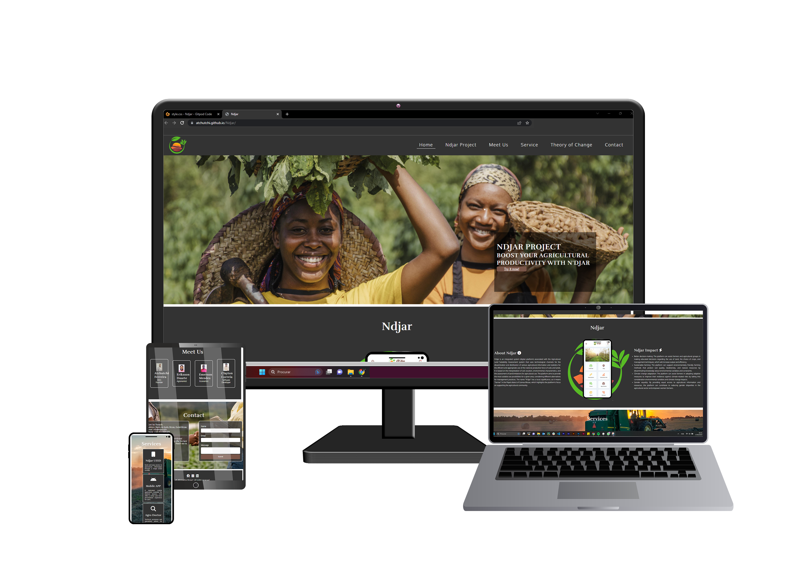

# Project-Portfolio
# N'djar - Digital Platform for Agricultural Land Suitability Assessment

## Overview

N'djar is an integrated system (digital platform) associated with the Agricultural Land Suitability Assessment system that uses technological 
channels for the dissemination and distribution of various agricultural information and statistics for the efficient and appropriate use of 
the national productive force of soils and lands. It is based on the interpretation of soil vocation, environmental characteristics, and the 
assessment of land limitations for agricultural use. The platform aims to provide the most suitable use possibilities for a given area, 
considering different alternatives for management practices.

Through N'djar, users can access information such as what, how, and where to produce, soil vocation, and suitable cultivation for each cultivation 
plot. The distribution system includes a 3-digit USSD number, APK mobile applications, and technical assistance.

## Table of Contents
- Overview
- Strategy
- Features
- Testing
- Validator Testing
- Deployment
- Credits

## Strategy

The main goal of the platform is to provide users with easy access to agricultural information, land suitability assessments, 
and technical assistance. The platform will be designed with a clean and straightforward interface that allows users to navigate
and access the information they need quickly.

## Features

    - Featured on all three pages, the full responsive navigation bar includes links to the Logo, Home , Ndjar Project, 
    Meet Us, Service, Theory of Change and contact page to allow for easy navigation.

    - This section will allow the user to easily navigate across all devices without having to revert back to the previous 
    page via the ‘back’ button because is one page website.

    - My landing page features an image of the female farmers, who represent the largest productive force in Guinea-Bissau,
    along with a call to action for website visitors to contact us immediately and improve their productivity.

    - The Ndjar Project page provides detailed information about the project, its objectives, and the impact it has on the community.
    This section showcases the organization's work and achievements.

    - The services page highlights the 3 services:

    1. **N'djar USSD Application**: Quick and easy access to agricultural information through a 3-digit USSD number.

    2. **N'djar Mobile APK Application**: A dedicated mobile application, available for Android devices, that offers 
    a richer and more personalized experience for users.

    3. **N'djar Technical Consultancy**: Technical assistance and specialized advice for farmers, helping them make 
    informed decisions and improve productivity.

    - The Theory of Change page explains the organization's approach to creating positive change in the community. 
    It provides insights into their methodology and guiding principles.

    -The Meet Us page introduces the team members behind the organization users connect with the people responsible for the project's success.

    - The Contact Us page provides users with a simple form to get in touch with the organization, as well as contact information such as 
    phone numbers, email addresses, and social media links.

    - The footer contains essential social media icons to help users stay connected with the organization. 

## Testing

The project's features, functionality, and responsiveness across various browsers and screen sizes 1200px, 950px, 800px equal or bellow were the main emphasis of the testing procedure where I had a lot of difficulty adapting when to use padding and margin, combining with flexbox. soon I spent many days testing the code using google devtool to see how responsive it is when I reduce it, looking for the best format so that the contents are well illustrated and presented.

- When using the css validator [https://jigsaw.w3.org/css-validator/validator] I found this error below, and to fix it by remove the px since "400px" is not a valid value for this property. The font-weight property accepts unitless numbers and predefined weight names
"12 body Value error : font-weight 400px is not a value font-weight : 400px";

### Feature Testing

#### Navigation Menu (responsivity)
- I was having a lot of difficulty adapting my navigation menu to align correctly, from the "Home" option to "Contact". I also had trouble keeping it visible when using responsiveness for screens of 950px and 800px. I reduced the font size to 70% in the @media (max-width: 950px) and used display flex to maintain the alignment without breaking the text in the line. In the @media (max-width: 800px), I used the "flex-direction: column-reverse" property on the "ul" menu to order the text and position the options in vertical columns.

#### Main Image (zoom in, responsivity)
- I was using the Main Image outer in style.css and it was working well, but I had issues when creating media queries for screen responsiveness of 950px and smaller. I tried using height auto, 100%, max-height 400px and 600px, but it didn't look good and the image was always distorted. So, I moved the background image from style.css to index.html, where I added the img src tag, using the object-fit property to maintain the image's aspect ratio without distorting it. With this change, I removed the background from the CSS and the .main-image class, and added object-fit: cover to the .main-image img class.
Link reference: [https://developer.mozilla.org/en-US/docs/Web/CSS/object-fit]

- To implement the zoom in effect, I initially used the `zoomIn` animation with `linear forwards` and `@keyframes` with `background-size`, but it wasn't working. After researching at [https://www.w3schools.com/howto/howto_css_zoom_hover.asp], I realized that the `img` tag is not a background, so I had to change it to `transform scale`.

- Service (responsivity)
- Team (responsivity)

### Responsiveness Testing

The following browsers were used to test the website for compatibility and uniform appearance:

- Mozilla Firefox 
- Google Chrome
- Safari 
- Microsoft Edge

In addition, the site's responsiveness was examined across a range of screen sizes, including those of mobile devices and huge desktop monitors.

### Validator Testing

#### HTML
by running the test at [https://validator.w3.org/] Document checking completed. No errors or warnings to show

#### CSS

## Deployment
The site was deployed to GitHub pages. The steps to deploy are as follows:
- Log in to your GitHub account and go to the main page of your repository.
- Click on the "Settings" tab at the top of the repository page.
- Scroll down to the "GitHub Pages" section.
- In the "Source" drop-down menu, select "main" or "master" (depending on your setup) and choose the "root" or "docs" folder if you are using a specific folder to host your site.
- Click on "Save."
- The page will refresh, and after a few moments, you will see a message stating that the deployment was successful. The live link to your site will be provided just below this message.

## Credits

### Content

- The text for the "N'djar" project was provided by me the project owner through the study carried.
out with field research and market analysis for the implementation of the business model.
- The font of the text was used google font [https://fonts.google.com/]
- The icons were imported from Font Awesome [https://fontawesome.com/]

### Media
- The logo of the project was created by me.
- To create Skeleton of the project it was used the Balsamiq wireframe [https://balsamiq.cloud/sf5rzkr/pcm5qyn/r0DFF].
- The images from the webpage was downloaded at Freepik and Unsplash [https://www.freepik.com/] [https://unsplash.com/].
- The SDG images was downloaded at Wikipedia.
- The icons in the footer were taken from Font Awesome [https://fontawesome.com/]

### Code
- There was no copy paste code from another source or website but inspirations on how to do it.
- Assistance with HTML, CSS was provided by [https://developer.mozilla.org/en-US/docs/Web/CSS/object-fit] [https://css-tricks.com/], and [https://www.w3schools.com/].
- Tutorials and documentation from [https://www.youtube.com/watch?v=7-orzsht98k].
- [My Mentor Can Sücüllü] were consulted during the development process.
- the development of the site was inspired by the Love Running website of the code institute.