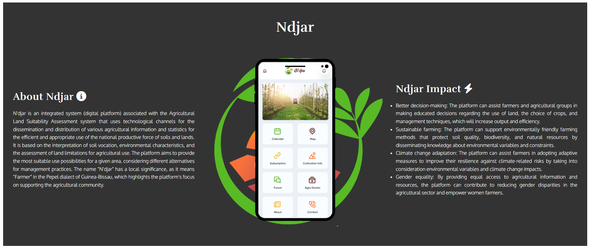

# Project-Portfolio
# N'djar - Digital Platform for Agricultural Land Suitability Assessment

## Overview

N'djar is an integrated system (digital platform) associated with the Agricultural Land Suitability Assessment system that uses technological 
channels for the dissemination and distribution of various agricultural information and statistics for the efficient and appropriate use of 
the national productive force of soils and lands. It is based on the interpretation of soil vocation, environmental characteristics, and the 
assessment of land limitations for agricultural use. The platform aims to provide the most suitable use possibilities for a given area, 
considering different alternatives for management practices.

Through N'djar, users can access information such as what, how, and where to produce, soil vocation, and suitable cultivation for each cultivation 
plot. The distribution system includes a 3-digit USSD number, APK mobile applications, and technical assistance.

## Table of Contents
- Overview
- Strategy
- Features
- Testing
- Validator Testing
- Deployment
- Credits

## Strategy

The main goal of the platform is to provide users with easy access to agricultural information, land suitability assessments, 
and technical assistance. The platform will be designed with a clean and straightforward interface that allows users to navigate
and access the information they need quickly.

## Features

    - Featured on all three pages, the full responsive navigation bar includes links to the Logo, Home , Ndjar Project, 
    Meet Us, Service, Theory of Change and contact page to allow for easy navigation.

    - This section will allow the user to easily navigate across all devices without having to revert back to the previous 
    page via the ‘back’ button because is one page website.

    - My landing page features an image of the female farmers, who represent the largest productive force in Guinea-Bissau,
    along with a call to action for website visitors to contact us immediately and improve their productivity.

    - The Ndjar Project page provides detailed information about the project, its objectives, and the impact it has on the community.
    This section showcases the organization's work and achievements.

    - The services page highlights the 3 services:

    1. **N'djar USSD Application**: Quick and easy access to agricultural information through a 3-digit USSD number.

    2. **N'djar Mobile APK Application**: A dedicated mobile application, available for Android devices, that offers 
    a richer and more personalized experience for users.

    3. **N'djar Technical Consultancy**: Technical assistance and specialized advice for farmers, helping them make 
    informed decisions and improve productivity.

    - The Theory of Change page explains the organization's approach to creating positive change in the community. 
    It provides insights into their methodology and guiding principles.

    -The Meet Us page introduces the team members behind the organization users connect with the people responsible for the project's success.

    - The Contact Us page provides users with a simple form to get in touch with the organization, as well as contact information such as 
    phone numbers, email addresses, and social media links.

    - The footer contains essential social media icons to help users stay connected with the organization. 

## Testing

The project's features, functionality, and responsiveness across various browsers and screen sizes 1200px, 950px, 800px equal or bellow were the main emphasis of the testing procedure where I had a lot of difficulty adapting when to use padding and margin, combining with flexbox. soon I spent many days testing the code using google devtool to see how responsive it is when I reduce it, looking for the best format so that the contents are well illustrated and presented.

### Feature Troubleshooting

1. **Problem:** Main Image (zoom in, responsivity) I was using the Main Image outer in style.css and it was working well, but I had issues when creating media queries  for screen responsiveness of 950px and smaller. 
    - **Solution:** I tried using height auto, 100%, max-height 400px and 600px, but it didn't look good and the image was always distorted. So, I moved the background image from style.css to index.html, where I added the img src tag, using the object-fit property to maintain the image's aspect ratio without distorting it. With this change, I removed the background from the CSS and the .main-image class, and added object-fit: cover to the .main-image img class.
    - Link reference: (https://developer.mozilla.org/en-US/docs/Web/CSS/object-fit)
    - To implement the zoom in effect, I initially used the `zoomIn` animation with `linear forwards` and `@keyframes` with `background-size`, but it wasn't working. After researching at (https://www.w3schools.com/css/css3_animations.asp), I realized that the `img` tag is not a background, so I had to change it to `transform scale`.

2. **Problem:** The 2 columns of the contact belonged to the same class and I couldn't add margin between them.
    - **Solution:** I created a new class to distinguish the two columns and be able to make the necessary formatting.
    - **Commit:** [Link to the related commit]( https://github.com/atchutchi/Ndjar/commit/96dd93b19ab4f04e9a4ac0d3da3c278cec00031a)
    - **Commit:** [Link to the related commit]( https://github.com/atchutchi/Ndjar/commit/3a0b1ee7cb751677a501675c755d8fcec3f9ad95)

3. **Problem:** When using the css validator [https://jigsaw.w3.org/css-validator/validator] I found this error "12 body Value error : font-weight 400px is not a value font-weight : 400px";, 
    - **Solution:** to fix it by remove the px since "400px" is not a valid value for this property. The font-weight property accepts unitless numbers and predefined weight names.
    - **Commit:** [Link to related commit](https://github.com/atchutchi/Ndjar/commit/917601fe028034299f907211288b621c84cecb39)

### Responsiveness Testing

#### Logo and Navigtion Bar
1. **Problem:** The menu didn't look good in responsive format, it collapsed, and it wasn't aligned from home to contact.
    - **Solution:** I reorganized the media queries for 950px and 800px and smaller, making the font size reduce to 70px for 950px and smaller, and for 800px and below, I used flex direction: column-reverse to keep the navigation bar aligned in a column (this also sorted the menu to keep it in the correct order)..
    - **Commit:** [Link to related commit]( https://github.com/atchutchi/Ndjar/commit/40879cd6e7e414607156f33d897409738448c564)
    - **Commit:** [Link to final commit]( https://github.com/atchutchi/Ndjar/commit/1244e66ac83acc6957e9b1fb8af07b69539a11ae)

2. **Problem:** Alignment of the logo and navigation bar.
    - **Solution:**  Using Chrome DevTools, I identified the problem with the width and added padding and margin-bottom to resolve the alignment issue for @media 950px and below.   - **Commit:** [Link to related commit](https://github.com/atchutchi/Ndjar/commit/0692589fcc4023b86c9f390131c0c46c789e7cc3)

3. **Problem:** After run the validator w3 html i found an error when using the <h3> after <a> element within the <button> as a direct descendant of that element.
    - **Solução:** I combined the 2 elements inside the <a> and styled it in CSS as a button, thus solving the problem. Then, I created a button class and used the display inline, and formatted the text and padding.
    - **Commit:** [Link to related commit](https://github.com/atchutchi/Ndjar/commit/39118edf928c7a70985f93230c65e738ab1578ce)
     - **Commit:** [Link to related commit]( https://github.com/atchutchi/Ndjar/commit/a6b68689c9ed497fd57870dfee5917a8b4ad4168)
    - **Commit:** [Link to related commit]( https://github.com/atchutchi/Ndjar/commit/5dc5061dd00693c3a33827410663eb8914cdc92e)

#### Landing Page
1. **Problem:** The Landing page image was not adjusting properly for responsive formats of 950px or smaller. I tried using various Height formats to see if it looked good when switching devices and took the opportunity to adjust the title-slogan to adapt to responsiveness.
    - **Solution:** After several troubleshooting attempts, I removed the image from the CSS and added it to the HTML, and it worked well.
    - **Commit:** [Link to related commit]( https://github.com/atchutchi/Ndjar/commit/2ba9d155a7e0835c7e69c606e62af03c976b3cf1)
    - **Commit:** [Link to related commit]( https://github.com/atchutchi/Ndjar/commit/a67614db943a4d94b5664221e87fee9d0ad9405c)
    - **Commit:** [Link to the final result]( https://github.com/atchutchi/Ndjar/commit/a67614db943a4d94b5664221e87fee9d0ad9405c)

#### Service
1. **Problem:** The title of the Service section and the columns were not aligned vertically and centered.
    - **Solution:** I added flex direction and aligned it to the center by removing the margins; it almost looked good, but the columns still seemed misaligned.
    - **Commit:** [Link to related commit]( https://github.com/atchutchi/Ndjar/commit/6e9629e153d69344c0bb35b9919276934a083b1e)

2. **Problem:** Could not align the service title with the service content to the center.
    - **Solution:** By doing responsiveness test on smarthphone in devtool replaces display block to display table and it worked.
    - **Commit:** [Link to related commit](https://github.com/atchutchi/Ndjar/commit/d8bbf7428a803f33306c7a8bf674619e00ce66e8)

#### Theory of Change

#### Meet us
1. **Problem:** When testing the responsive layout in the Meet Us section for medium and small screens, the columns overlapped each other, and the text went out of shape, so the content of the columns was not displayed correctly on mobile devices.
    - **Solution:** I used flex direction: column and aligned them to the center.
    - **Commit:** [Link to related commit]( https://github.com/atchutchi/Ndjar/commit/6242dfd9d07cb8ad0903a3ad61c0e1b2cba545e9)

2. **Problem:** The texts inside the box are outside the border when it is in smartphone responsive format.
    - **Solution:** I set the text to have font-size all of 100%.
    - **Commit:** [Link to related commit](https://github.com/atchutchi/Ndjar/commit/805d6589b9fdd73f58dcaf0a14dad1cf35d20527)

#### Contact
1. **Problem:** When testing the responsive layout in the Meet Us section for medium and small screens, the columns overlapped each other, and the text went out of shape, so the content of the columns was not displayed correctly on mobile devices.
    - **Solution:** I used flex direction: column and aligned them to the center.
    - **Commit:** [Link to related commit]( https://github.com/atchutchi/Ndjar/commit/3f7d1632eb07a083745b7f0abd0bdb2c2adcfe86)

The subsequent web browsers were utilized to evaluate the website's compatibility and consistent appearance. Comprehensive responsiveness tests were conducted, and the results indicated satisfactory performance across these platforms, ensuring a seamless user experience.
- Mozilla Firefox 

- Google Chrome

- Microsoft Edge

In addition, the site's responsiveness was examined across a range of screen sizes, including those of mobile devices and huge desktop monitors.

### Validator Testing

#### HTML
by running the test at [Validator w3 html](https://validator.w3.org/) Document checking completed. No errors or warnings to show

#### CSS
by running the test at [Jigsaw w3 css/](https://jigsaw.w3.org/css-validator/)
W3C CSS Validation Results for TextArea (CSS Level 3 + SVG)
No errors were found in your stylesheet.

#### Accessibility
- I confirmed that colors and fonts chosen are easy to read and accessible by running it through lightouse in chrome devtools

#### Unsolved testing
1. **Problem:** In the media query for 800px and below, I couldn't position the logo to be centered on the left. I tried some troubleshooting but couldn't resolve the issue.
     - **Commit:** [Link to related commit]( https://github.com/atchutchi/Ndjar/commit/c11b2850dfeb7a79c5114baf7b72cebd4e76ed75)
     - **Commit:** [Link to related commit]( https://github.com/atchutchi/Ndjar/commit/0692589fcc4023b86c9f390131c0c46c789e7cc3)

## Deployment
The site was deployed to GitHub pages. The steps to deploy are as follows:
- Log in to your GitHub account and go to the main page of your repository.
- Click on the "Settings" tab at the top of the repository page.
- Scroll down to the "GitHub Pages" section.
- In the "Source" drop-down menu, select "main" or "master" (depending on your setup) and choose the "root" or "docs" folder if you are using a specific folder to host your site.
- Click on "Save."
- The page will refresh, and after a few moments, you will see a message stating that the deployment was successful. The live link to your site will be provided just below this message.

## Credits

### Content

- The text for the "N'djar" project was provided by me the project owner through the study carried.
out with field research and market analysis for the implementation of the business model.
- The font of the text was used google font (https://fonts.google.com/).
- The icons were imported from Font Awesome (https://fontawesome.com/).

### Media
- The logo of the project was created by me.
- Screenshot of the responsive where taken from (https://ui.dev/amiresponsive?url=https://atchutchi.github.io/Ndjar/).
- To create Skeleton of the project it was used the Balsamiq wireframe (https://balsamiq.cloud/sf5rzkr/pcm5qyn/r0DFF).
- The images from the webpage was downloaded at Freepik and Unsplash (https://www.freepik.com/) (https://unsplash.com/).
- The SDG images was downloaded at Wikipedia.
- The icons in the footer were taken from Font Awesome (https://fontawesome.com/)

### Code
- There was no copy paste code from another source or website but inspirations on how to do it.
- I used gitpod and codeanywhere for the development of the project as a whole.
- Assistance with HTML, CSS was provided by (https://developer.mozilla.org/en-US/docs/Web/CSS/object-fit) (https://css-tricks.com/), and (https://www.w3schools.com/).
- Tutorials and documentation from Code Institute class module and youtube video [https://www.youtube.com/watch?v=7-orzsht98k].
- [My Mentor Can Sücüllü] were consulted during the development process.
- the development of the site was inspired by the Love Running website of the code institute.